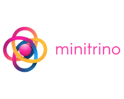

    

# Minitrino

A command line tool that makes it easy to run modular Trino environments
locally. Compatible with Starburst versions 402-e and later.

-----

**Latest Stable Release**: 2.0.8

-----

## Quick Start

To learn more about the CLI and underlying library, visit the following wiki
pages:

- [Installation and
  Upgrades](https://github.com/jefflester/minitrino/wiki/Installation-and-Upgrades)
- [Workflow
  Examples](https://github.com/jefflester/minitrino/wiki/Workflow-Examples)
- [Environment Variables and
  Config](https://github.com/jefflester/minitrino/wiki/Environment-Variables-and-Config)
- [Build a Module](https://github.com/jefflester/minitrino/wiki/Build-a-Module)
